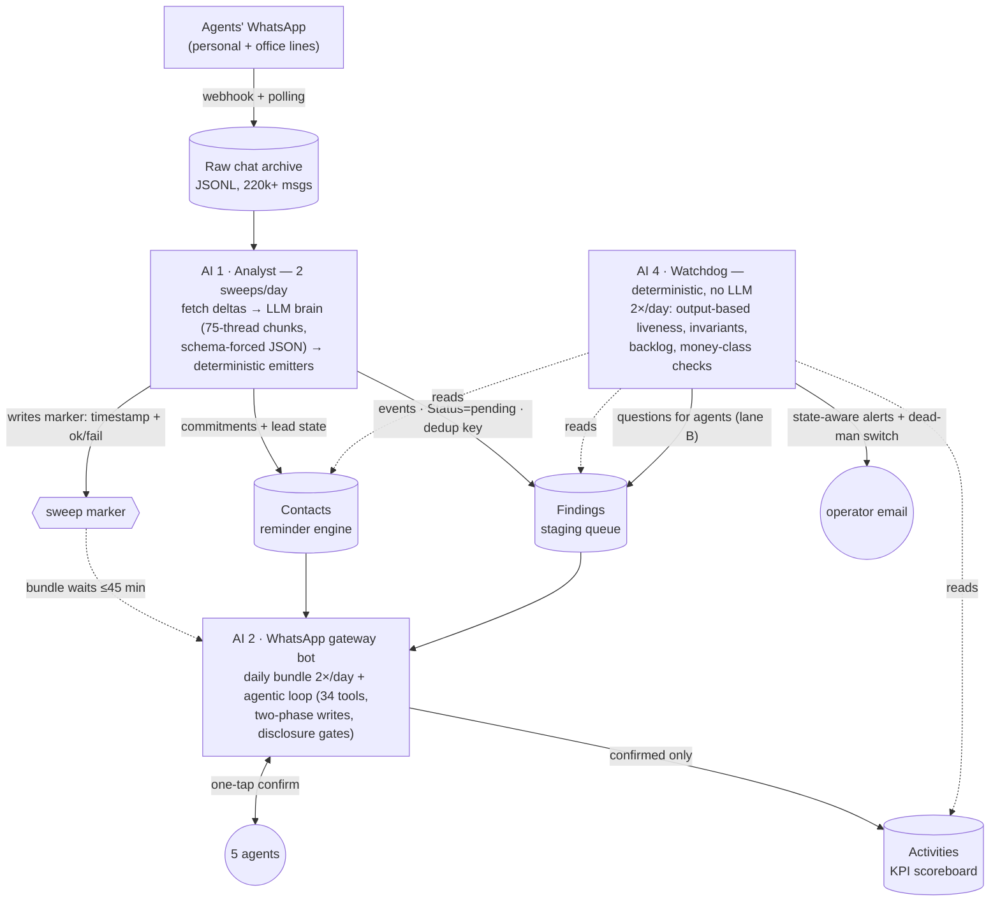
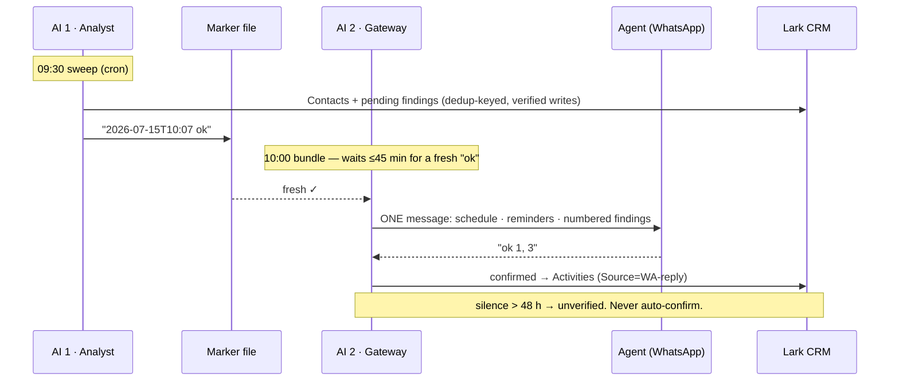

# chat-to-crm

**Turning five agents' WhatsApp into a CRM the boss can trust** — a three-agent LLM pipeline with a deterministic watchdog, designed, shipped, and operated solo for a mid-size real-estate brokerage in Jakarta.

`Jun–Aug 2026` · Python · SQLite (WAL) · Docker Compose · cron · Lark Base API · WhatsApp BSP API · Claude Opus + GPT (structured outputs)

> The production system is private (client PII), but one component is publicly runnable: **[▶ try the listing-parser live demo](https://honest-balance-production.up.railway.app/parse)** — an open-source extract with its eval harness ([repo](https://github.com/kaylaelishevaa/real-estate-ai-platform)).

| | |
|---|---|
| **220k+** | WhatsApp messages archived & indexed |
| **0** | records ever written without human confirmation |
| **1,200+** | automated tests across three repos |
| **16d → 2d** | worst silent-failure window, June vs. August |
| **< $35/mo** | total LLM spend, all pipelines |

---

## Context

All of the brokerage's deal flow lives in WhatsApp — five agents negotiating rentals and sales across ~7,500 listings. The CRM (Lark Base) was supposed to be the scoreboard, but manual logging had quietly died: **in the month before this project, agents logged zero activities**, and only 2% of 1,300 legacy records were linked to a contact. Management had no visibility, and follow-ups were leaking real commission.

The owner's constraint ruled out every conventional fix: *agents will not change how they work.* No forms, no app, no typing into the CRM. If the system wanted data, it had to read the chats itself and come to the agents inside WhatsApp.

## Constraints

- **Trust over coverage.** The CRM is a scoreboard for KPIs and compliance — one fabricated record poisons the whole board. An LLM may propose; only a human confirms.
- **PII discipline.** Raw chats never leave the archive; the CRM stores conclusions only. Quotes are scrubbed (client names masked, phones redacted), and the Q&A bot has hard disclosure gates (an owner's name may be shared, a phone number never).
- **Cost ceiling ≈ $30/month** for all LLM reading — which forced tiered models and chunked batch processing instead of "throw the biggest model at everything."
- **One engineer** (me), heavily AI-assisted, building and operating in production simultaneously.

## Architecture

Four narrow roles instead of one clever bot. Two LLM agents that are never allowed to touch the same table with write access, one non-LLM listing bot, and a watchdog with **no LLM at all**:

*Fig. 1 — The pipeline. Solid = writes, dotted = reads. Each table has exactly one writer for each field group.*

### The decisions that made it work

- **Split by datum type, single writer per table.** Commitments and lead state go to *Contacts* (keyed per person — the reminder engine). Discrete events go to a *Findings* staging table (keyed per event, with a content-derived dedup key). The analyst may only create rows as `pending`; every later status, and the KPI table itself, belongs to the gateway bot. Field ownership is enforced in code on both sides.
- **Confirmation is the product.** Findings become KPI records only after an agent taps "ok" in WhatsApp. Silence for 48 h marks them `unverified` — never auto-confirmed. When a rogue legacy path wrote 135 unconfirmed records, we deleted them and added a watchdog check that alarms if the count ever rises above ~10/day.
- **Sequencing without a message broker.** The morning sweep and the 10:00 bundle are separate cron jobs on separate repos. The handoff is a status-bearing marker file (`<timestamp> ok|fail`); the bundler polls it for up to 45 minutes. Crucially the marker carries *failure* too — an early version treated any fresh marker as success, and a failed sweep masqueraded as fresh data.
- **Idempotency everywhere.** Dedup keys on findings, an order-independent SHA-1 batch hash on multi-item submissions (same batch resent = "already saved", not a double write), and fetch cursors that advance *only for contacts whose writes were verified by read-back*.
- **Deterministic where it counts.** The 6-value alert tier is computed in code from dates and stage — the LLM's suggestion is ignored. Kill-switch phrases ("stop", "none of these") are parsed before the model is ever called. And the watchdog is 100% deterministic, so the thing checking the LLMs can never hallucinate.

*Fig. 2 — The daily cycle. One bundle per agent per slot; the human tap is the only path to the scoreboard.*

**→ Deep dive: [inside the WhatsApp gateway](docs/gateway-deep-dive.md)** — the deterministic front door, the agentic loop, two-phase writes, the 24-hour-window engine, and the eval that gated launch.

## Production log — what actually happened

The architecture above is the *end state*. Most of it was earned in production. Condensed from the project changelog (630+ entries):

### 10–14 Jun — Contract-first design, dark launch 🚀
Wrote a formal "action contract" splitting the work into four AI roles before building. Gateway shipped dark (zero users) behind a per-agent canary flag; staging table created; **960 tests** passing; all bot output redirected to me with a `[TEST]` prefix.

### 15–19 Jun — Archive + windowing engine
Full chat export: **150k messages across 6 accounts**, plus a realtime webhook archiver behind a stable tunnel. Built WhatsApp's 24-hour-window rules into an outbound queue (free-form inside the window, one template opener with cooldown outside it). Mid-week the bot went down for hours — API credits ran out. First lesson in operating, not just building.

### 15 Jun–1 Jul — The 16-day silent outage 🔴
The analyst produced **zero output for 16 days** while its cron ran green every day — a dry-run default plus a watchdog that was itself down. Worse: a mid-outage check declared it "recovered", because rows *were* appearing in the findings table — written by the watchdog, not the analyst. The false all-clear held for 4 days. Fix: **liveness is now measured at the output, filtered by source** ("did rows tagged `chat:` land in the last 26 h?"), never by "the process ran".

### 3 Jul — Q&A go-live: NO-GO, then GO, same day 🚀
Replayed **38 real agent messages** through the router as an eval before launch. First verdict: NO-GO — two blocking bugs in listing lookup. Five commits later (calibrated fuzzy matching; below threshold the bot must say "not found" rather than guess), re-ran the eval: GO. Routing accuracy 67.5% → 78.1% effective, factual QA 94%.

### 3–4 Jul — The 853-finding surge 🔴
A backfill without its archive tag flooded staging to **853 pending items** — enough to bury every agent. Triaged to 75 (15 per agent) in one pass, then made structural: freshness windows on emitters, per-run question caps, and the marker file upgraded to carry `ok|fail`.

### 4–8 Jul — The `.progress` deadlock 🔴
Finding-emission died for 4 days. Root cause: a rare zero-work morning took an early-exit path that skipped cleanup of a progress file, so every later sweep believed all agents were already done — **a self-sustaining deadlock** where the failure state guaranteed its own repetition. Fixed on every exit path + a self-healing check + an anomaly flag for "emitted zero despite candidates".

### 10 Jul — Money-class carve-out
Audit found the July mass-triage had dismissed **99 findings that mentioned money** (invoices, down-payments, commissions) with the same rules as small talk — a spec bug, not a code bug. All 99 re-opened; money-class items became structurally immune to suppression, with their own drip-fed follow-up group and a dedicated watchdog check (target: 0 silently-dismissed money items — verified 0).

### 23–30 Jul — One poisoned phone number = 7 days down 🔴
The analyst extracted `"+62 8xx… (his ISP guy)"` into a phone-typed field. The CRM rejected the *entire batch update*, the write never verified, the cursor never advanced — so the next run refetched the same thread and crashed identically, twice a day for a week. Same deadlock *class* as `.progress`, different organ. Fix: a writer seatbelt (validate `^\+?\d{8,15}$`, truncate, flag) — and the recognition that **cursor-advance-only-after-verified-write turns any rejected write into a loop**, so writers must sanitize before the gate.

### 27–30 Jul — Structural work order: 6 packages, 3 phases, 1 canary agent 🚀
Consolidated a week of conversation-quality failures (a hijacked stale draft rewrote an agent's schedule; a repeated pending-list dump until an agent snapped "read your memory") into one spec: state sync, schedule-writer hardening, a "check memory" freeze protocol, 30-day TTLs, feature flags per package, replay tests against the named real cases. Rolled out phase-by-phase behind a single-agent canary.

### 31 Jul–2 Aug — The webhook that detached itself 🔴
Inbound leads stopped — the WhatsApp provider's webhook registration had silently dropped; the channel was alive, the deliveries just stopped. Two days of leads never entered the system. Re-registered via API and added a dead-man check (alert on N hours of silence). The same audit killed a subtler bug: items carried 3 days were "escalated to the digest" — **but the digest renderer for that class had never been written**, so they vanished forever. Replaced with a drip carry-over: nothing is ever dropped, only paced.

### 2–3 Aug — End-to-end verification, independently re-checked
Traced one lead through the full chain live — chat → analyst label → WhatsApp bundle → 🔴 alert — green. Found one leak (an alert cleared on refresh before ever being delivered), root-caused and fixed it, then had the closing claims re-verified against raw data; two of my own claims were disproven and corrected in the log.

## Results

- Five agents live on the pipeline daily: two analysis sweeps, two bundles, and all-day Q&A over listings, contacts, activities, and 220k+ archived messages — with hard disclosure gates.
- KPI scoreboard integrity held: **zero auto-confirmed records**; the one rogue writer (135 unconfirmed rows) was detected, purged, and alarm-guarded.
- Open-item backlog brought from a peak of **920 rows to 372** through triage plus structural fixes (drip carry-over, TTL, auto-close-from-evidence).
- Worst silent-failure window shrank from **16 days (June) to ~2 days (August)** — every later outage was caught by an output-based watchdog check or a dead-man switch, and each produced a named, tested guard.
- Three dormant leads worth ≈ Rp 256M in potential commission surfaced by the sleeper-lead detector after being silently suppressed by two stacked guards — the finding that motivated making alert blocks deterministic and suppression-immune.
- All of it within the LLM budget ceiling, via tiered models (small model classifies, big model extracts) and 75-thread chunked batching with split-on-choke recovery.

## What I'd tell the next engineer

1. **Measure liveness at the output, and filter by source.** "The cron ran" hid a 16-day outage. "Rows exist in the table" hid it for 4 more days, because another writer's rows looked like life. The only honest signal is: did *this producer's* rows land, recently?
2. **Self-sustaining deadlocks are a class, not a bug.** Any design where failure blocks the very cleanup that would allow retry (a leftover progress file, an unadvanced cursor) will reproduce itself forever. Every exit path cleans up; every gate that blocks progress needs a seatbelt in front of it.
3. **Be deterministic at the edges, probabilistic in the middle.** LLMs read and propose. Code computes tiers, parses kill-switches, enforces field ownership, and watches the watchers. The guard rail must not be made of the same material as the thing it guards.
4. **Alerts have a reputation to protect.** A watchdog that emails the same backlog daily trains everyone to ignore it. State-aware gating (alert on change, weekly heartbeat, dead-man switch) is what makes an alert mean something.
5. **Silent writes are future incidents.** A field-overwrite bug ran for 26 days because the writes never hit the audit trail. Every mutation now carries provenance — which is also what made every later root-cause analysis take hours instead of weeks.
6. **Humans confirm; models never do.** The single most important line in the system is the one that marks a finding `unverified` after 48 h of silence instead of assuming consent.

## Companion repos

- **[real-estate-ai-platform](https://github.com/kaylaelishevaa/real-estate-ai-platform)** — runnable open-source extract of the listing-parser component (the pipeline's third agent), with its LLM-correctness eval harness. **[▶ Live demo](https://honest-balance-production.up.railway.app/parse)**.
- **[pulse-case-study](https://github.com/kaylaelishevaa/pulse-case-study)** — the real-time WhatsApp ingestion & alerting system that grew alongside this pipeline: exactly-once capture, idempotent fan-out, ~460 tests.

---

*Built and operated solo, Jun–Aug 2026, working heavily AI-assisted (Claude Code) — architecture, debugging, and operational decisions are my own, and every incident above is documented in the project's changelog and commit history.*

*Company, agents, and identifiers anonymized. Figures are from the project's own logs; detailed write-ups and a code walkthrough available on request.*
