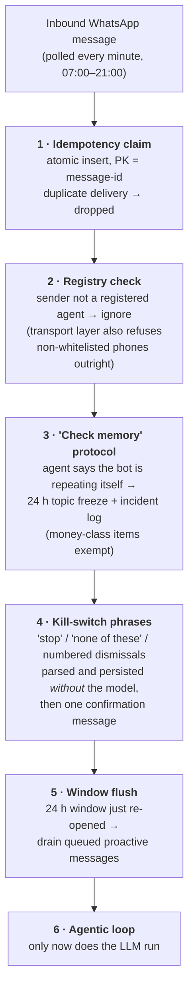
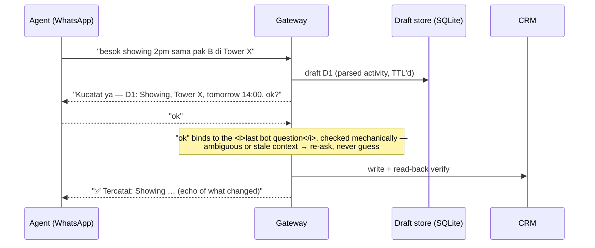

# Deep dive: inside the WhatsApp gateway

*Part of the [chat-to-crm](../README.md) case study. The gateway ("AI 2") is the only component that talks to humans — which is why most of the system's guardrails live here.*

The gateway's job sounds simple: let real-estate agents manage their CRM by chatting in WhatsApp. The hard part is everything around the LLM call — because this bot **writes to a production CRM**, on behalf of users who never asked to be beta testers, over a channel (WhatsApp Business) with its own messaging rules.

This doc covers the five layers that made it safe: the deterministic front door, the agentic loop, the two-phase write protocol, the outbound window engine, and the eval that gated launch.

---

## 1. The front door is deterministic — the model is the *last* resort

Every inbound message walks a fixed ladder before any LLM is involved:

The ordering is the point. The messages where a wrong answer is most costly — "stop asking me about this" — are exactly the ones that must never depend on a model's mood. A suppression request that the LLM "creatively reinterprets" is a user-trust incident; a regex that persists it with a read-back verify is not.

## 2. The agentic loop: narrow, grounded, impersonation-proof

The loop itself is conventional (system prompt → tool calls → final text), with a few production-shaped constraints:

- **Max 8 steps, temperature 0 — enforced, not requested.** The LLM client *raises* if any call site passes a nonzero temperature. Every call is logged with full request/response for replay debugging.
- **33 tools, but the model never chooses who it is.** The caller's identity (`agent`, phone, permissions) is injected server-side from the phone-number registry into every tool call. There is no tool argument the model could use to act as someone else.
- **Forced first tools.** Cheap heuristics pre-route obvious shapes — a bulk "done done done" reply forces a schedule lookup first; a paste of a listing URL takes a fast path that resolves and links it with no LLM at all.
- **Grounding checks on the way out.** The most interesting one is the **anti-empty-promise guard**: if the final text claims something was saved ("noted!", "won't ask again") but no write-tool actually fired in that loop, the reply is discarded and replaced with an explicit numbered question — and an anomaly is logged. LLMs are pathologically eager to *claim* success; the guard makes the claim mechanical.
- **Two consecutive failures → escalation.** A per-agent fail-streak counter routes the conversation into the operator digest instead of letting the bot flail.

### Disclosure gates

The Q&A side (10 lookup tools over listings, contacts, activities, and the message archive) has hard rules evaluated *in the tools*, not in the prompt: a property owner's **name** may be shared with the assigned agent, a **phone number never**; raw chat is never quoted verbatim; other agents' clients are masked. Putting the gate in the tool means a jailbroken prompt still can't leak what the tool never returns.

## 3. Two-phase writes: propose → one-tap confirm

No agent message ever writes to the CRM directly. The write path is a draft protocol:

Three details carry the weight:

- **Batch idempotency.** Multi-item submissions are hashed (order-independent, content-derived, 24 h TTL). An agent resending the same batch — WhatsApp users double-send constantly — gets "already saved," not duplicate records.
- **Draft TTL.** Drafts expire. This rule was paid for in production: a stale unconfirmed draft once sat dormant until an unrelated "ok" revived it and hijacked a batch of six new appointments — rewriting an agent's real schedule. Every draft now has a lifetime, and "ok" binding is checked against *what the bot last asked*.
- **Silence is not consent.** A proposal the agent never confirms goes to `unverified` after 48 hours. The system reminds (rate-limited: first nudge after 2 h, max 2, working hours only) — it never assumes.

## 4. The 24-hour window engine

WhatsApp Business only allows free-form messages within 24 h of the user's last message; outside it, only pre-approved templates. Naive bots either go silent or spam template messages. The gateway runs an outbound queue per agent:

- Window **open** → send freely.
- Window **closed** → queue the message; send at most **one** template opener with a 6 h cooldown.
- Agent replies (window re-opens) → drain the queue, capped per flush so nobody gets 15 messages at once.

Combined with the daily-bundle design (*one* consolidated message per agent per slot, capped at 5 items with drip carry-over), the bot stays useful without ever becoming the contact you mute.

## 5. The eval that gated launch

Before the Q&A layer went live, 38 real agent messages were replayed through the router across three runs. First verdict: **NO-GO** — routing accuracy 67.5% and two blocking bugs in listing lookup. The fixes were characteristic of the whole system: calibrated fuzzy matching with an explicit floor — **below the confidence threshold the bot must answer "not found" with suggestions, and is forbidden to answer from data**. Same day, re-run: 78.1% effective routing, 94% factual accuracy on the QA subclass, GO.

The eval suite stayed: a baseline file plus replay harness, re-run on routing changes. When a conversation fails in production, its anonymized shape becomes a test case — the replay corpus only grows.

---

## What transfers

If you're building an agent that writes to systems people rely on:

1. Put the scary intents (stop/dismiss/delete) **before** the model, not in the prompt.
2. Make identity a server-side injection, never a model-visible argument.
3. Separate *proposing* from *committing*, and make the commit check mechanical.
4. Enforce invariants (temperature, whitelists, disclosure) in the client/tools where they cannot be un-asked.
5. Treat "the model claimed it did X" as untrusted input — verify against what actually executed.
6. Replay real traffic as your eval; let incidents feed the corpus.

*Names, numbers, and identifiers anonymized; patterns and incidents are real and documented in the project changelog.*
